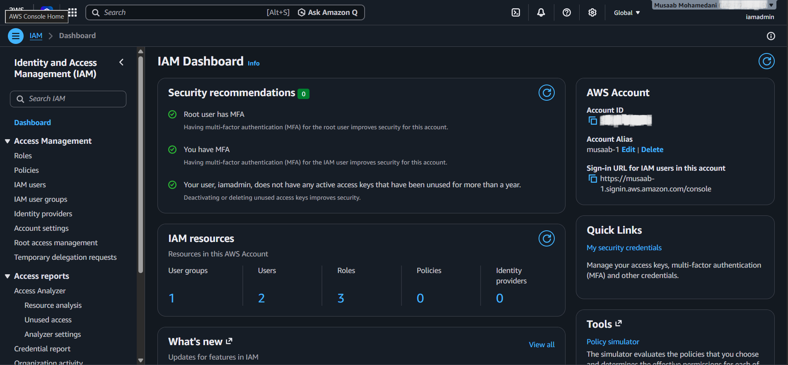
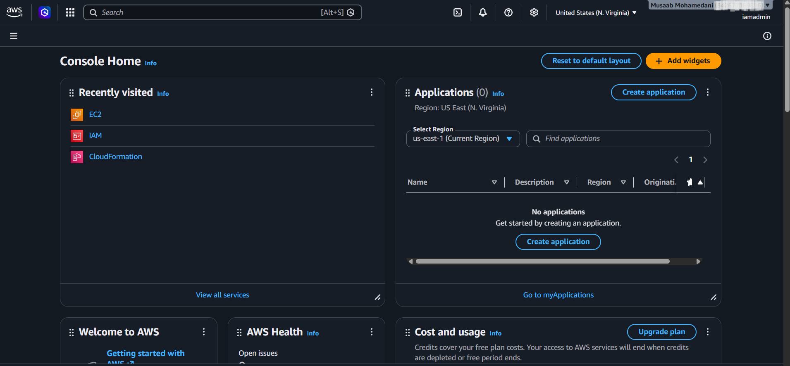
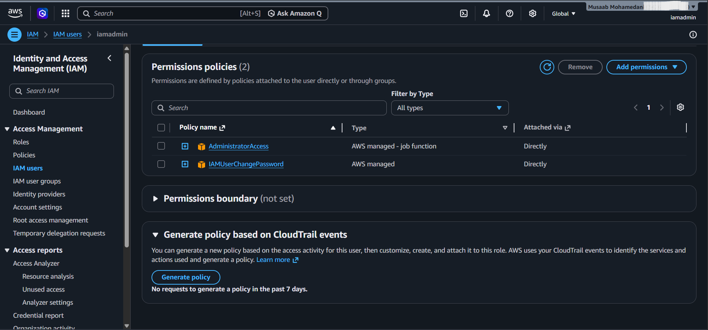
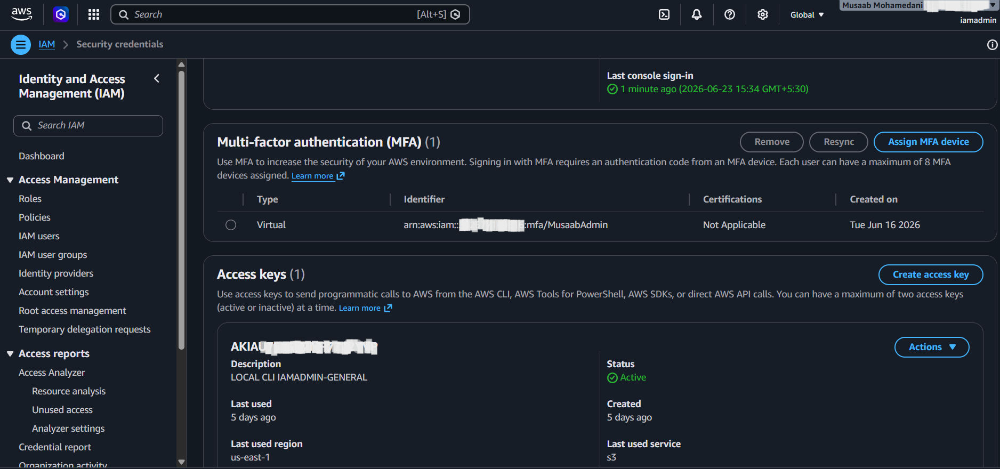

# Lab 02 – Create IAM User

**Status:** ✅ Complete

## Objective

Create an IAM user with AWS Management Console access and understand how IAM users improve AWS account security compared to using the Root User.

## Tasks Completed

* Created an IAM Administrator user
* Enabled AWS Management Console access
* Assigned AdministratorAccess permissions
* Enabled MFA on the IAM user
* Successfully logged in using the IAM user
* Reviewed IAM Dashboard and account sign-in URL
* Switched daily administration from Root User to IAM User

## Evidence

### IAM Dashboard

### IAM Admin User

### AdministratorAccess Policy

### MFA Enabled

## Key Learning

* IAM users provide individual identities for accessing AWS resources.
* Multi-Factor Authentication (MFA) should be enabled for privileged accounts.
* The Root User should only be used for account-level tasks.
* Permissions can be granted using IAM policies.
* AdministratorAccess provides full administrative permissions across AWS services.
* Following AWS security best practices improves account protection.

## Result

Successfully created and secured an IAM Administrator user with AWS Management Console access and MFA. This user is now used for daily AWS administration instead of the Root User, following AWS security best practices.
