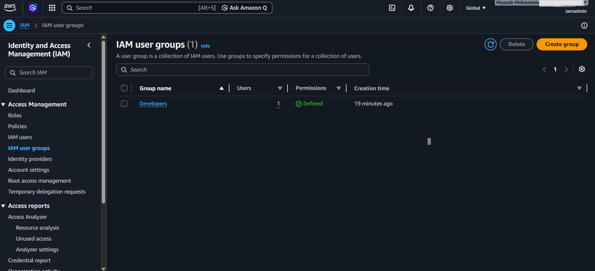
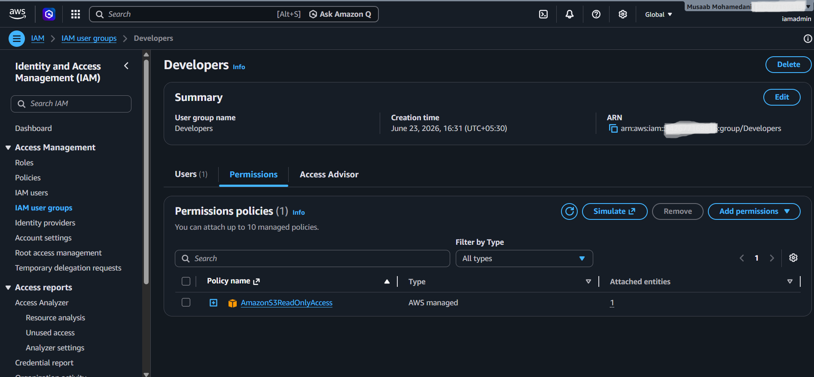
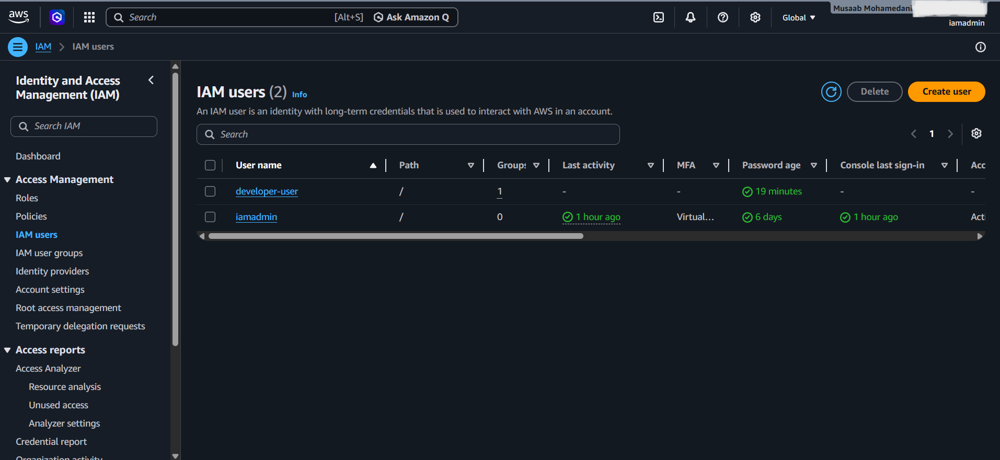
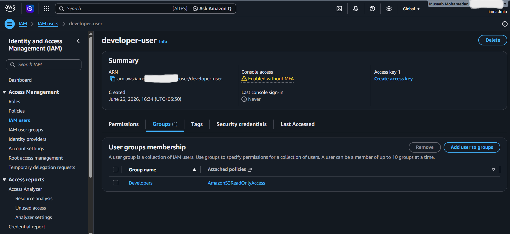
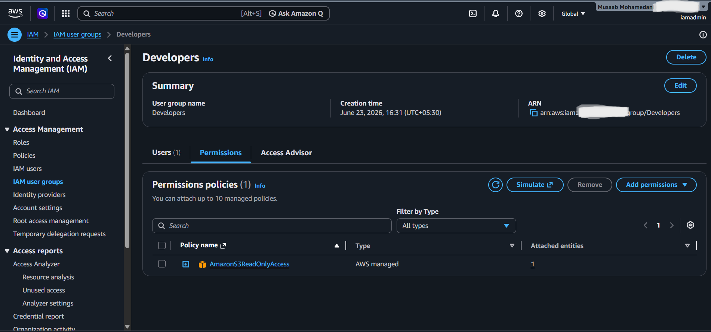

# Lab 03 – IAM Groups and Permission Management

**Status:** ✅ Completed

## Objective

Learn how to manage AWS permissions using IAM Groups and understand how group-based access control simplifies administration and improves security.

## Tasks Completed

* Created an IAM group named `Developers`
* Attached the AWS managed policy `AmazonS3ReadOnlyAccess`
* Created an IAM user named `developer-user`
* Added the user to the `Developers` group
* Verified that permissions are inherited through group membership

## Evidence

### 1. Developers IAM Group Created

### 2. AmazonS3ReadOnlyAccess Policy Attached to the Group

### 3. Developer IAM User Created

### 4. User Added to Developers Group

### 5. Group Membership and Permissions Verification

## Key Learning

* IAM Groups allow permissions to be managed centrally.
* Users inherit permissions from the groups they belong to.
* Assigning permissions to groups is more scalable than assigning permissions directly to individual users.
* AWS managed policies provide predefined permission sets for common use cases.
* Group-based access control follows AWS security best practices.

## Result

Successfully implemented group-based access management by creating a Developers IAM group, attaching permissions to the group, and granting access to a user through group membership. This approach improves scalability, consistency, and security within AWS environments.
